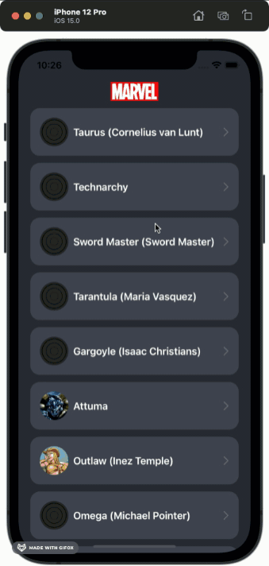

# Marvel App

## Purpose
This app is just an example on how to use Composable Architecture from pointfree.co

## Demo

## Decisions
- Used Composable Architecture as Redux is a good match with SwiftUI
- User ImageURL as external dependency just for simplicity
- Used Snapshot testing to prevent UI Changes
- Added unit tests for Reducers and Services
